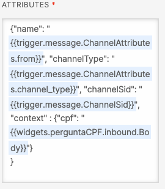
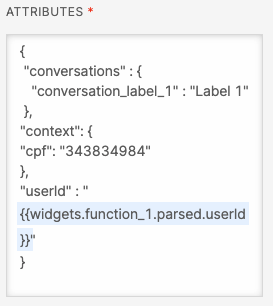
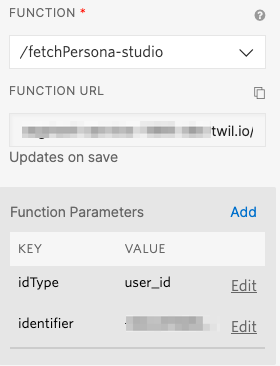
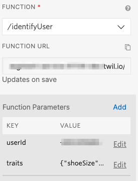

# Customer Context Plugin

This Flex plugin renders context coming from a chatbot (using [Twilio Studio](https://www.twilio.com/studio) or otherwise) onto the agent's screen. It also enables fetching customer traits and events from [Twilio Segment](https://www.twilio.com/segment-hello)

## Requirements

* [Twilio CLI](https://www.twilio.com/docs/twilio-cli/quickstart)
* [Twilio CLI Flex Plugin Extension](https://www.twilio.com/docs/flex/developer/plugins/cli)
* [Twilio Serverless Toolkit](https://www.twilio.com/docs/labs/serverless-toolkit)
* [Segment Account](https://app.segment.com/signup/) (not required if Customer Traits and Events won't be used)

## Usage

### Using the Context Tab

This plugin will read everything on the **context** object within the Task Attributes and renders them in the screen (key and value). This approach was taken to render only relevant information to the agent, and keep information only relevant for routing purposes out of it.

When handing off a conversation to an agent on Flex through the **Send to Flex** widget, pass the **context** object like the example below:



**IMPORTANT:** If you don't use Studio to hand off conversations to Flex, the approach still works. Just make sure you're passing a **context** object within the Task Attributes.

### Using the Segment Integration

The plugin will automatically fetch both traits and events from the **Segment Profile API**, using the **Segment Service** described below.

#### Passing the User ID to Flex

We identify users differently depending on the channel. To normalize that, we pass a *User ID* to Flex as a Task Attribute, so we can match with your user identifier on Segment. To do that, with the *Task Attributes JSON* on Studio, pass a parameter called **userId**, like the picture below:



### Calling the Segment Service from Studio

The **Segment Service** included with this repo can also be called from Studio to fetch a persona (and use traits and events for routing, for example) and to identify a user (new trait identified by the bot, for example).

#### Fetch Persona

From within a Studio flow, call the `fetch-persona-studio` function, passing parameter as shown in the picture below:



The *idType* is the type of ID you're going to use in Segment. Normally, it's *user_id*, but you can use every custom identifier on Segment as well. The *identifier* field is the information you obtained from your customer from your bot or IVR, or even their phone number.

**IMPORTANT:** DO NOT use the `fetch-persona` function within Studio. Because it's called client-side, it needs to be public, so authentication is managed using Flex Token Authentication. The one prepared specially for Studio is a *protected* function that can only be called from within Twilio.

#### Identify User

From within a Studio flow, call the `identifyUser` function, passing parameter as shown in the picture below:



The *userId* parameter is the identification that is going to be used for the user. The *traits* parameter is a JSON object containing the traits you want to identify.

## Setup

### Segment Service

The plugin includes a service used to fetch personas data using a **Twilio Function**, so the plugin doesn't have to call the API directly and expose Segment credentials. To deploy it, follow the procedure below:

```bash
cd serverless
```

```bash
cp .env.example .env
```

Fill the `.env` file with you Segment account info:

| Config&nbsp;Value | Description                                                                                                                                                  |
| :---------------- | :----------------------------------------------------------------------------------------------------------------------------------------------------------- |
| Segment Space ID | Identifier for your Segment account. To obtain it, go to **Personas -> Settings -> API Access**.                                    |
| Segment Persona Key | The API Key for access to Segment Personas. In the same screen where you obtained the Space Key, click **Generate** and copy the generated Access Token                                |
| Segment Write Key | A write key used for user identification within Studio. Uses the **[Nodejs Source](https://segment.com/docs/connections/sources/catalog/libraries/server/node/quickstart/)** |


Run

```bash
twilio serverless:deploy
```

The first deployment will generate a domain. **Copy it**. It'll be used during the Plugin deployment.

### Plugin

Make sure you have [Node.js](https://nodejs.org) as well as [`npm`](https://npmjs.com). We support Node >= 10.12 (and recommend the _even_ versions of Node). Afterwards, install the dependencies by running `npm install`:

```bash
cd 

# If you use npm
npm install
```

Copy the environment file example into a usable one.

```bash
cp .env.example .env
```

Fill out the `.env` file with `FLEX_APP_FUNCTIONS_BASE`, using the Serverless Domain you copied from the Service deployment


Finally, to deploy the plugin, run

```bash
twilio flex:plugins:deploy
```

You can also run the plugin locally for testing purposes:

```bash
twilio flex:plugins:start
```

This will start a local instance of Flex at port `3000`

#### Using the Plugin without Segment

If you wish to use only the **Bot Context** tab and ignore Segment traits and events you can do it. Just keep the `FLEX_APP_FUNCTIONS_BASE` empty.

## Development

Run `twilio flex:plugins --help` to see all the commands we currently support. For further details on Flex Plugins refer to our documentation on the [Twilio Docs](https://www.twilio.com/docs/flex/developer/plugins/cli) page.

